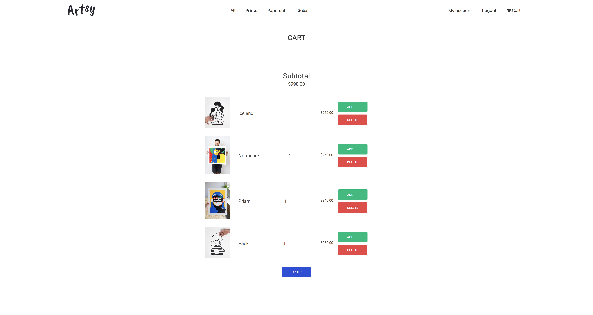

# ft_minishop - Artsy

After one week learning the basics of PHP, I built with @nestoralonsovina a small e-commerce in PHP.

Oh it's messy and definitely against all best practices but it works.

That's how you learn I guess !

## Visuals
<p align="center">
  
</p>
<p align="center">
  
</p>

## Features
- basic CRUD on products & users
- users auth
- admin panel


## Usage

```
// load the assets
php install.php

// run it
php -S localhost:8080
```