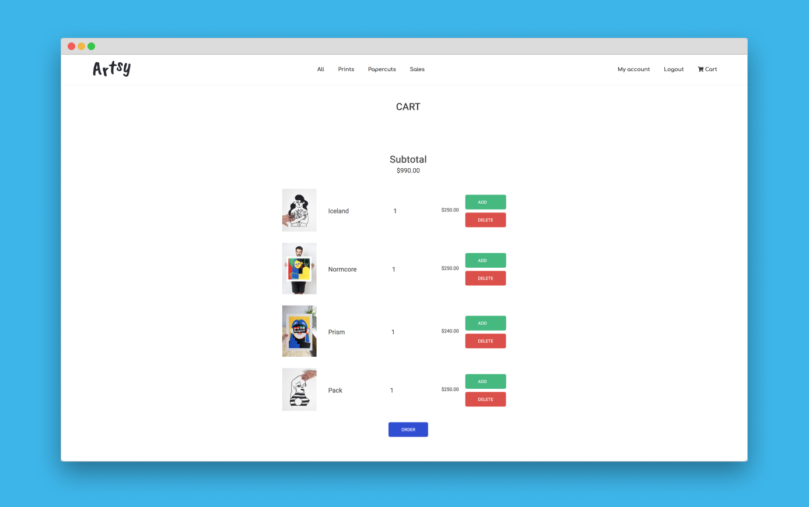

# Rush00 - ft_minishop

After one week learning the basics of PHP, we built a basic e-commerce with [@nestoralonsovina](https://github.com/nestoralonsovina) in 48 hours.

Oh it's messy and definitely against all best practices but it works.

That's how you learn I guess 🤷‍♂️

## Subject
Rush00 - ft_minishop [subject](https://github.com/bouplusbou/ft_minishop/blob/master/readme_assets/rush00.en.pdf)

## Features
- basic CRUD on products & users
- users auth
- admin panel


## Usage

```
// load the assets
php install.php

// run it
php -S localhost:8080
```

## Visuals
**Galery**
<p align="center">
  
</p>

**Cart**
<p align="center">
  
</p>

Photos courtesy of [José Antonio Roda](https://josearoda.bigcartel.com)

## Score
[**111**/100]